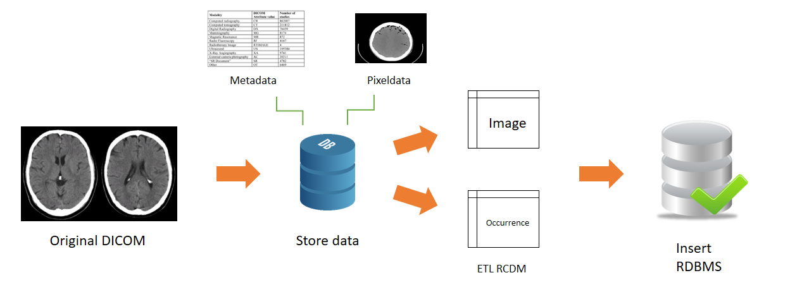

# Radiology CDM ETL Module

[](https://travis-ci.com/OHDSI/Radiology-CDM)
[](https://codecov.io/github/OHDSI/Radiology-CDM?branch=master)


## Overview

Metadata extraction module of DICOM images.


## How to work



- Radiology-CDM extracts Metadata and Pixeldata from DICOM file, which is the original radiology image, and combines the data required for RCDM and stores it in DB format and converts it into CDM.

- Just copy and paste this code into your Rstudio!<br> All you have to do is just change 'path' and 'core' in DICOMHeaderList function.<br>RadiologyCDM function will read all of the DICOM files under the 'path' you've specified. <br>Now check the variable 'Radiology_Image_Table' and, 'Radiology_Occurrence_Table'!

- If you want to observe result of database analysis, you can use RCDMShinyViewer function.<br> All you have to do is to download 'LoincRsnaRadiologyPlaybook.csv' file which is uploaded on this github page.<br> This file is a mapping table for radiolgy terminologies.

```R

devtools::install_github('ABMI/Radiology-CDM')
library(RadiologyCDM)
library(dplyr)
library(ParallelLogger)
library(digest)
library(shiny)
library(ggplot2)
library(DT)

#Please don't change the name of variables : 'DICOMList', 'Radiology_Occurrence_Table', 'Radiology_Image_Table', 'LoincRsnaRadiologyPlaybook'
DICOMList<-DICOMHeaderList('path to DICOM files', core = 4)
Radiology_Occurrence_Table<-radiologyOccurrenceTable(DICOMList)
Radiology_Image_Table<-radiologyImageTable(DICOMList)
LoincRsnaRadiologyPlaybook<-read.csv('LoincRsnaRadiologyPlaybook.csv')
RCDMShinyViewer(Radiology_Occurrence_Table, Radiology_Image_Table)
```
